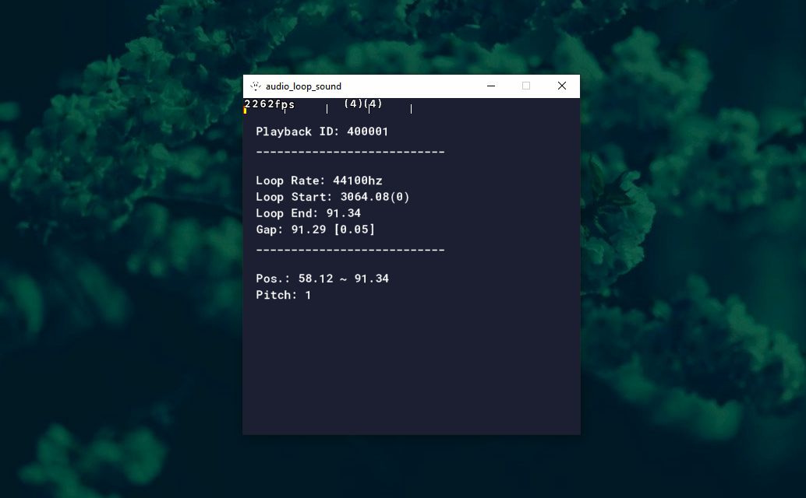

# audio_loop_sound

Play multiple audios using sampled loop points.



> [**Demo**][demo] (Windows)

## Usage

**Syntax**

```gml
audio_loop_sound(sound, sample_begin, sample_end, sample_rate, priority)
```

- **GameMaker: Studio 1.4**
	1. Open your project.
	2. In the resource tree, go to **Extensions**, right click and then select **Import extension**.
	3. Select the **.gmez** file, open it, go to **Import resources** and select what files you want to import.

- **GameMaker Studio 2**
	1. Open your project.
	2. Drag and drop the **.yymp** file to the main IDE window and select **Ye**.
	3. Choose what files you want to import.


[demo]: https://www.dropbox.com/scl/fi/ia490m0uo741mhey453p7/audio_loop_sound-Demo.zip?rlkey=xdi9111xrgwn9tsl0bkrxn5b0&dl=0
