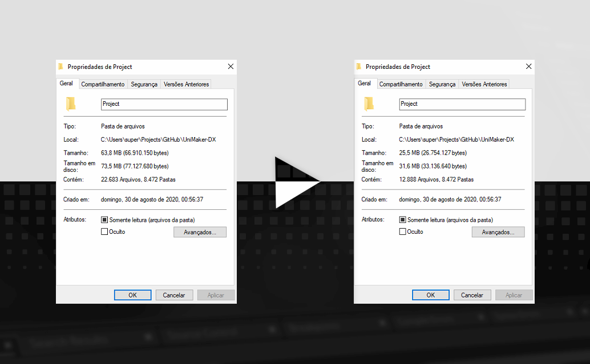

# Project Cleaner

Scan and remove unused assets and graphics from projects made with GameMaker Studio 2.

> [**Pre-compiled binary**][binary] (Windows)

## Usage

> **Tested with IDE v2.3.2.560** - This script won't work with projects made using GameMaker: Studio 1.4 or older versions of GameMaker Studio 2.

- Always make a backup of your project before using it.

1. Make sure that the **sandbox** is disabled on your IDE.
2. Copy and paste this [script](./Script.gml) into the creation code.
3. Run the project.
4. Select the **.yyp** file of the project you want to scan.
	+ If it is the same one you are using to run this script, I recommend that you run the script from another project.
6. Wait until the process is done, a log should be generated.

[binary]: https://drive.google.com/file/d/1sATLdaEugtW-YbV3kAaaiOYTFHyCSJun/view?usp=sharing
